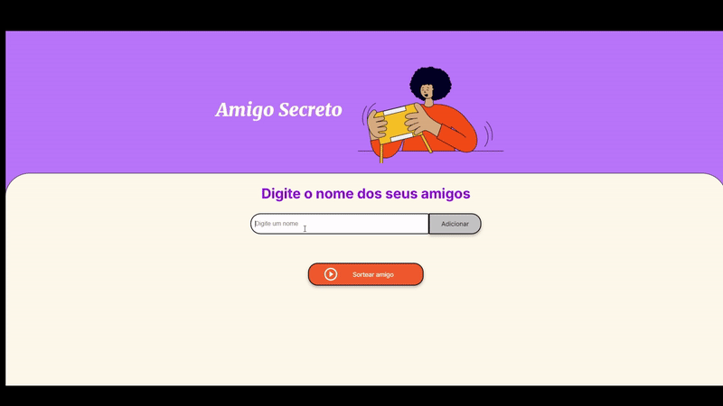

# 🎁 Amigo Secreto
Um sistema simples e interativo para criar listas de amigos e sortear de forma divertida o famoso Amigo Secreto! Desenvolvido com HTML, CSS e JavaScript, com foco em um layout animado e uma experiência de usuário fluida.


Este projeto foi desenvolvido como parte de um desafio proporcionado pela Alura em parceria com a Oracle, incentivando a prática e o aprendizado de desenvolvimento web de maneira criativa.

--- 

## ✨ Funcionalidades
- **Adicionar amigos:** Insira os nomes dos participantes na lista.
- **Exibição da lista:** Os nomes adicionados aparecem com animações suaves.
- **Sorteio dinâmico:** Sorteia aleatoriamente um nome da lista com feedback visual.
- **Design moderno:** Layout estilizado e animações interativas.
- **Transições suaves:** Experiência visual fluida, com efeitos em destaque.

---

## 🚀 Como usar
1. Clone o repositório:
   ```bash
   git clone https://github.com/seu-usuario/amigo-secreto.git
   ```
2. Abra o arquivo `index.html` no navegador.

---

## 🖌️ Estrutura do projeto
- **index.html**: Estrutura básica do sistema.
- **style.css**: Estilo e animações para o layout.
- **app.js**: Lógica de adição, exibição e sorteio dos amigos.

---

## 💡 Tecnologias utilizadas
- **HTML5** para a estrutura.
- **CSS3** para estilização e animações.
- **JavaScript** para lógica e interatividade.

---

## 🎉 Demonstração


Teste você mesmo! ✨  
 ```bash
     https://amigosecreto-sepia.vercel.app
   ```

---

## 🛠️ Próximos passos
- [ ] Adicionar a opção de remover amigos da lista.
- [ ] Permitir salvar e carregar listas.
- [ ] Melhorar a responsividade para dispositivos móveis.

---

## 💻 Contribuindo
Sinta-se à vontade para contribuir com melhorias!  
1. Faça um fork do projeto.
2. Crie uma branch para suas alterações: `git checkout -b minha-feature`.
3. Envie suas alterações: `git push origin minha-feature`.
4. Abra um pull request.

---

## 📜 Licença
Este projeto está sob a licença MIT. Sinta-se livre para usá-lo e modificá-lo.
